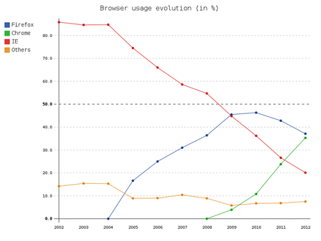

pygal-toggle-graphs
===================

A JavaScript module that allows you to toggle the visibility of graphs in the
charts generated by [pygal](http://github.com/Kozea/pygal) when viewing them in
a browser.

Usage
-----

When you generate the charts in Python, simply append a link to this module in
the list of JavaScript modules that should be embedded in the chart:
```python
import pygal

js = [
  'http://kozea.github.com/pygal.js/javascripts/svg.jquery.js',     # Original
  'http://kozea.github.com/pygal.js/javascripts/pygal-tooltips.js', # Original
  'http://rawgit.com/s3rvac/pygal-toggle-graphs/master/pygal-toggle-graphs.js'
]

line_chart = pygal.Line(js=js)
# Populate the chart with data.
# ...
line_chart.render_to_file('graph.svg')
```
After that, when viewing the chart on a website, click on a legend to toggle
the visibility of the corresponding graph (show/hide). For a description of how
to embed a chart on your website, consult the [documentation of
pygal](http://pygal.org/documentation/).

Example
-------

An online example can be seen
[here](http://projects.petrzemek.net/pygal-toggle-graphs/) or in the GIF
screencast below.

[](example/screencast.gif)

Notes
-----

* The module should work with any type of a chart.
* It requires the presence of the original JavaScript modules that are
  distributed with [pygal](http://github.com/Kozea/pygal). At the time of
  writing, these are the two modules listed above in the usage description.
* It was tested with [pygal](http://github.com/Kozea/pygal) 1.4-1.5 and
  [Mozilla Firefox](www.mozilla.org/en/firefox/) 27.0-33.0,
  [Google Chrome](https://www.google.com/intl/en/chrome/browser/) 33.0,
  [Opera](http://www.opera.com) 20.0, and
  [Apple Safari](https://www.apple.com/safari/) 5.1.
* The implementation is inspired by the scripts in
  [pygal.js](https://github.com/Kozea/pygal.js/).

License
-------

Copyright (c) 2014 Petr Zemek <s3rvac@gmail.com>

Distributed under GNU LGPLv3:

    This program is free software: you can redistribute it and/or modify it
    under the terms of the GNU Lesser General Public License as published by
    the Free Software Foundation, either version 3 of the License, or (at your
    option) any later version.

    This program is distributed in the hope that it will be useful, but WITHOUT
    ANY WARRANTY; without even the implied warranty of MERCHANTABILITY or
    FITNESS FOR A PARTICULAR PURPOSE. See the GNU Lesser General Public
    License for more details.

    You should have received a copy of the GNU Lesser General Public License
    along with this program. If not, see <http://www.gnu.org/licenses/>.
